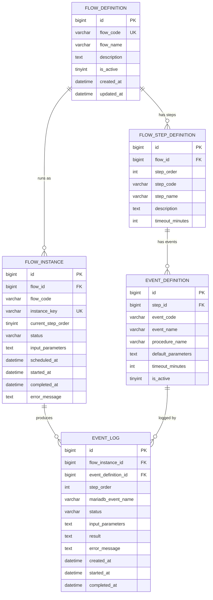
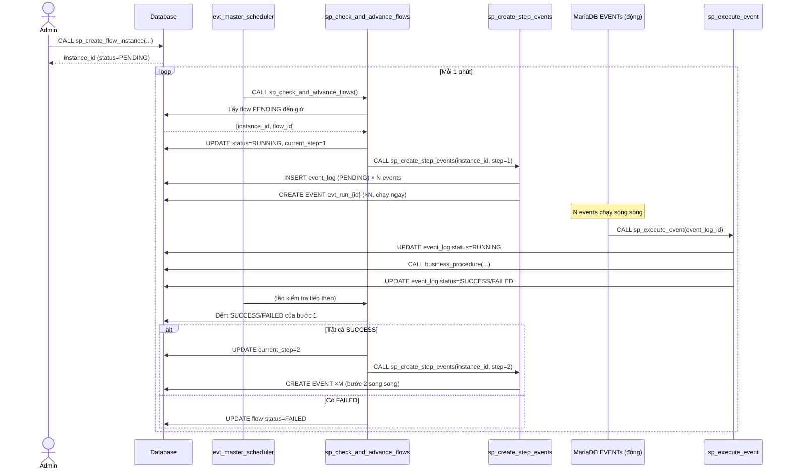

# Database Design: Flow Scheduler – MariaDB

## Thông tin chung

| Thuộc tính  | Giá trị                                      |
|-------------|----------------------------------------------|
| Module      | Salary Service – Flow Scheduler              |
| Database    | MariaDB (>= 10.4)                            |
| Phiên bản   | v1.0                                         |
| Ngày tạo    | 2026-04-22                                   |
| Người tạo   | CAM Team                                     |

---

## 1. Tổng Quan Kiến Trúc

### 1.1 Mô tả nghiệp vụ

Hệ thống cho phép định nghĩa các **luồng xử lý (flow)** bao gồm nhiều **bước (step)** tuần tự.  
Mỗi **bước** bao gồm nhiều **event chạy song song**.  
Bước sau chỉ được bắt đầu khi **tất cả event của bước trước** đã hoàn thành thành công.

```
LUỒNG (FLOW)
├── Bước 1 (Step 1)  ← tuần tự
│   ├── Event A  ┐
│   ├── Event B  ├── song song
│   └── Event C  ┘
├── Bước 2 (Step 2)  ← chỉ chạy khi Bước 1 xong 100%
│   ├── Event D  ┐
│   └── Event E  ┘ song song
└── Bước 3 (Step 3)  ← chỉ chạy khi Bước 2 xong 100%
    └── Event F
```

### 1.2 Cơ chế hoạt động

```
[MASTER EVENT] (chạy mỗi 1 phút)
      │
      ▼
[sp_check_and_advance_flows]
      │
      ├── Với mỗi Flow Instance đang RUNNING:
      │       ├── Kiểm tra tất cả event của bước hiện tại đã SUCCESS?
      │       ├── Nếu có event FAILED → đánh dấu Flow là FAILED, dừng
      │       ├── Nếu tất cả SUCCESS → advance lên bước tiếp theo
      │       │       └── Gọi [sp_create_step_events] → tạo MariaDB EVENT động
      │       └── Nếu bước cuối hoàn thành → đánh dấu Flow là COMPLETED
      │
      └── Với Flow Instance PENDING → tạo event cho bước đầu tiên → chuyển RUNNING
```

---

## 2. Sơ Đồ ERD



---

## 3. Định Nghĩa Bảng (DDL)

### 3.1 Bảng `flow_definition` – Định nghĩa luồng

```sql
CREATE TABLE flow_definition (
    id              BIGINT          NOT NULL AUTO_INCREMENT,
    flow_code       VARCHAR(100)    NOT NULL COMMENT 'Mã luồng, unique, dùng để tạo instance',
    flow_name       VARCHAR(255)    NOT NULL COMMENT 'Tên luồng hiển thị',
    description     TEXT            NULL     COMMENT 'Mô tả luồng',
    is_active       TINYINT(1)      NOT NULL DEFAULT 1 COMMENT '1=active, 0=disabled',
    created_at      DATETIME        NOT NULL DEFAULT CURRENT_TIMESTAMP,
    updated_at      DATETIME        NOT NULL DEFAULT CURRENT_TIMESTAMP ON UPDATE CURRENT_TIMESTAMP,
    PRIMARY KEY (id),
    UNIQUE KEY uq_flow_code (flow_code)
) ENGINE=InnoDB DEFAULT CHARSET=utf8mb4 COMMENT='Định nghĩa các luồng xử lý';
```

### 3.2 Bảng `flow_step_definition` – Định nghĩa các bước trong luồng

```sql
CREATE TABLE flow_step_definition (
    id              BIGINT          NOT NULL AUTO_INCREMENT,
    flow_id         BIGINT          NOT NULL COMMENT 'FK → flow_definition.id',
    step_order      INT             NOT NULL COMMENT 'Thứ tự bước (1, 2, 3…), tuần tự',
    step_code       VARCHAR(100)    NOT NULL COMMENT 'Mã bước',
    step_name       VARCHAR(255)    NOT NULL COMMENT 'Tên bước',
    description     TEXT            NULL,
    timeout_minutes INT             NOT NULL DEFAULT 60 COMMENT 'Timeout tối đa cho cả bước (phút)',
    created_at      DATETIME        NOT NULL DEFAULT CURRENT_TIMESTAMP,
    PRIMARY KEY (id),
    UNIQUE KEY uq_flow_step (flow_id, step_order),
    UNIQUE KEY uq_flow_step_code (flow_id, step_code),
    CONSTRAINT fk_step_flow FOREIGN KEY (flow_id)
        REFERENCES flow_definition(id) ON DELETE CASCADE
) ENGINE=InnoDB DEFAULT CHARSET=utf8mb4 COMMENT='Định nghĩa các bước trong luồng (tuần tự)';
```

### 3.3 Bảng `event_definition` – Định nghĩa các event trong mỗi bước

```sql
CREATE TABLE event_definition (
    id                  BIGINT          NOT NULL AUTO_INCREMENT,
    step_id             BIGINT          NOT NULL COMMENT 'FK → flow_step_definition.id',
    event_code          VARCHAR(100)    NOT NULL COMMENT 'Mã event',
    event_name          VARCHAR(255)    NOT NULL COMMENT 'Tên event',
    procedure_name      VARCHAR(255)    NOT NULL COMMENT 'Tên stored procedure sẽ được gọi',
    default_parameters  TEXT            NULL     COMMENT 'Tham số mặc định dạng JSON',
    timeout_minutes     INT             NOT NULL DEFAULT 30 COMMENT 'Timeout tối đa cho event (phút)',
    is_active           TINYINT(1)      NOT NULL DEFAULT 1,
    created_at          DATETIME        NOT NULL DEFAULT CURRENT_TIMESTAMP,
    PRIMARY KEY (id),
    UNIQUE KEY uq_step_event_code (step_id, event_code),
    CONSTRAINT fk_event_step FOREIGN KEY (step_id)
        REFERENCES flow_step_definition(id) ON DELETE CASCADE
) ENGINE=InnoDB DEFAULT CHARSET=utf8mb4 COMMENT='Định nghĩa các event song song trong mỗi bước';
```

### 3.4 Bảng `flow_instance` – Instance đang chạy của luồng

```sql
-- STATUS: PENDING | RUNNING | COMPLETED | FAILED | CANCELLED
CREATE TABLE flow_instance (
    id                  BIGINT          NOT NULL AUTO_INCREMENT,
    flow_id             BIGINT          NOT NULL COMMENT 'FK → flow_definition.id',
    flow_code           VARCHAR(100)    NOT NULL COMMENT 'Snapshot mã luồng',
    instance_key        VARCHAR(255)    NOT NULL COMMENT 'Key định danh unique instance (vd: SALARY_2026-03-01)',
    current_step_order  INT             NOT NULL DEFAULT 0 COMMENT '0=chưa bắt đầu, N=đang ở bước N',
    status              VARCHAR(20)     NOT NULL DEFAULT 'PENDING'
                            COMMENT 'PENDING|RUNNING|COMPLETED|FAILED|CANCELLED',
    input_parameters    TEXT            NULL     COMMENT 'Tham số đầu vào JSON',
    scheduled_at        DATETIME        NULL     COMMENT 'Thời điểm được lên lịch chạy',
    started_at          DATETIME        NULL     COMMENT 'Thời điểm bắt đầu thực sự',
    completed_at        DATETIME        NULL     COMMENT 'Thời điểm kết thúc (thành công hoặc lỗi)',
    error_message       TEXT            NULL     COMMENT 'Thông báo lỗi nếu FAILED',
    created_at          DATETIME        NOT NULL DEFAULT CURRENT_TIMESTAMP,
    updated_at          DATETIME        NOT NULL DEFAULT CURRENT_TIMESTAMP ON UPDATE CURRENT_TIMESTAMP,
    PRIMARY KEY (id),
    UNIQUE KEY uq_instance_key (instance_key),
    KEY idx_status (status),
    KEY idx_flow_id (flow_id),
    CONSTRAINT fk_instance_flow FOREIGN KEY (flow_id)
        REFERENCES flow_definition(id)
) ENGINE=InnoDB DEFAULT CHARSET=utf8mb4 COMMENT='Instance thực thi của luồng';
```

### 3.5 Bảng `event_log` – Log từng lần chạy event

```sql
-- STATUS: PENDING | RUNNING | SUCCESS | FAILED | TIMEOUT | SKIPPED
CREATE TABLE event_log (
    id                      BIGINT          NOT NULL AUTO_INCREMENT,
    flow_instance_id        BIGINT          NOT NULL COMMENT 'FK → flow_instance.id',
    event_definition_id     BIGINT          NOT NULL COMMENT 'FK → event_definition.id',
    step_order              INT             NOT NULL COMMENT 'Bước số mấy trong luồng',
    mariadb_event_name      VARCHAR(255)    NULL     COMMENT 'Tên MariaDB EVENT được tạo động',
    status                  VARCHAR(20)     NOT NULL DEFAULT 'PENDING'
                                COMMENT 'PENDING|RUNNING|SUCCESS|FAILED|TIMEOUT|SKIPPED',
    input_parameters        TEXT            NULL     COMMENT 'Tham số thực tế JSON',
    result                  TEXT            NULL     COMMENT 'Kết quả trả về JSON',
    error_message           TEXT            NULL     COMMENT 'Thông báo lỗi nếu FAILED/TIMEOUT',
    retry_count             INT             NOT NULL DEFAULT 0 COMMENT 'Số lần đã retry',
    created_at              DATETIME        NOT NULL DEFAULT CURRENT_TIMESTAMP,
    started_at              DATETIME        NULL,
    completed_at            DATETIME        NULL,
    PRIMARY KEY (id),
    KEY idx_flow_instance (flow_instance_id),
    KEY idx_status (status),
    KEY idx_step (flow_instance_id, step_order),
    CONSTRAINT fk_log_instance FOREIGN KEY (flow_instance_id)
        REFERENCES flow_instance(id),
    CONSTRAINT fk_log_event_def FOREIGN KEY (event_definition_id)
        REFERENCES event_definition(id)
) ENGINE=InnoDB DEFAULT CHARSET=utf8mb4 COMMENT='Log thực thi từng event';
```

---

## 4. Stored Procedures

### 4.1 `sp_create_flow_instance` – Tạo mới một instance luồng

```sql
DELIMITER $$

CREATE PROCEDURE sp_create_flow_instance(
    IN  p_flow_code         VARCHAR(100),
    IN  p_instance_key      VARCHAR(255),
    IN  p_input_parameters  TEXT,            -- JSON string
    IN  p_scheduled_at      DATETIME,        -- NULL = chạy ngay
    OUT p_instance_id       BIGINT
)
BEGIN
    DECLARE v_flow_id   BIGINT;
    DECLARE v_now       DATETIME DEFAULT NOW();

    -- Lấy flow_id từ flow_code
    SELECT id INTO v_flow_id
    FROM flow_definition
    WHERE flow_code = p_flow_code AND is_active = 1
    LIMIT 1;

    IF v_flow_id IS NULL THEN
        SIGNAL SQLSTATE '45000'
            SET MESSAGE_TEXT = 'Flow code không tồn tại hoặc đã bị tắt';
    END IF;

    -- Tạo instance mới
    INSERT INTO flow_instance (
        flow_id, flow_code, instance_key,
        current_step_order, status,
        input_parameters, scheduled_at, created_at
    ) VALUES (
        v_flow_id, p_flow_code, p_instance_key,
        0, 'PENDING',
        p_input_parameters,
        IFNULL(p_scheduled_at, v_now),
        v_now
    );

    SET p_instance_id = LAST_INSERT_ID();
END$$

DELIMITER ;
```

---

### 4.2 `sp_create_step_events` – Tạo MariaDB EVENT cho từng event trong bước

```sql
DELIMITER $$

CREATE PROCEDURE sp_create_step_events(
    IN p_flow_instance_id   BIGINT,
    IN p_step_order         INT
)
BEGIN
    DECLARE v_done              INT DEFAULT 0;
    DECLARE v_event_def_id      BIGINT;
    DECLARE v_procedure_name    VARCHAR(255);
    DECLARE v_default_params    TEXT;
    DECLARE v_timeout_min       INT;
    DECLARE v_event_log_id      BIGINT;
    DECLARE v_event_name        VARCHAR(255);
    DECLARE v_input_params      TEXT;
    DECLARE v_step_id           BIGINT;
    DECLARE v_flow_id           BIGINT;
    DECLARE v_sql               TEXT;

    -- Cursor lấy danh sách event definitions của bước hiện tại
    DECLARE cur_events CURSOR FOR
        SELECT  ed.id,
                ed.procedure_name,
                ed.default_parameters,
                ed.timeout_minutes
        FROM    event_definition ed
        JOIN    flow_step_definition fsd ON fsd.id = ed.step_id
        JOIN    flow_instance fi ON fi.flow_id = fsd.flow_id
        WHERE   fi.id = p_flow_instance_id
          AND   fsd.step_order = p_step_order
          AND   ed.is_active = 1
        ORDER BY ed.id;

    DECLARE CONTINUE HANDLER FOR NOT FOUND SET v_done = 1;

    -- Lấy input_parameters từ flow_instance để merge với default_parameters
    SELECT input_parameters, flow_id
    INTO v_input_params, v_flow_id
    FROM flow_instance
    WHERE id = p_flow_instance_id;

    OPEN cur_events;
    event_loop: LOOP
        FETCH cur_events INTO
            v_event_def_id,
            v_procedure_name,
            v_default_params,
            v_timeout_min;

        IF v_done = 1 THEN
            LEAVE event_loop;
        END IF;

        -- Tạo bản ghi event_log (trạng thái ban đầu = PENDING)
        INSERT INTO event_log (
            flow_instance_id, event_definition_id,
            step_order, status,
            input_parameters, created_at
        ) VALUES (
            p_flow_instance_id, v_event_def_id,
            p_step_order, 'PENDING',
            IFNULL(v_input_params, v_default_params),
            NOW()
        );

        SET v_event_log_id = LAST_INSERT_ID();

        -- Đặt tên event động: evt_run_{flow_instance_id}_{event_log_id}
        SET v_event_name = CONCAT('evt_run_', p_flow_instance_id, '_', v_event_log_id);

        -- Cập nhật tên event vào event_log
        UPDATE event_log
        SET mariadb_event_name = v_event_name
        WHERE id = v_event_log_id;

        -- Tạo MariaDB EVENT chạy ngay (AT NOW())
        -- Event sẽ gọi procedure sp_execute_event với event_log_id
        SET v_sql = CONCAT(
            'CREATE EVENT IF NOT EXISTS `', v_event_name, '` ',
            'ON SCHEDULE AT NOW() + INTERVAL 1 SECOND ',
            'ON COMPLETION NOT PRESERVE ',
            'DO CALL sp_execute_event(', v_event_log_id, ');'
        );

        SET @dynamic_sql = v_sql;
        PREPARE stmt FROM @dynamic_sql;
        EXECUTE stmt;
        DEALLOCATE PREPARE stmt;

    END LOOP;
    CLOSE cur_events;
END$$

DELIMITER ;
```

---

### 4.3 `sp_execute_event` – Thực thi logic nghiệp vụ của một event

```sql
DELIMITER $$

CREATE PROCEDURE sp_execute_event(
    IN p_event_log_id BIGINT
)
BEGIN
    DECLARE v_procedure_name    VARCHAR(255);
    DECLARE v_input_params      TEXT;
    DECLARE v_timeout_min       INT;
    DECLARE v_sql               TEXT;
    DECLARE v_error_msg         TEXT DEFAULT NULL;

    DECLARE EXIT HANDLER FOR SQLEXCEPTION
    BEGIN
        GET DIAGNOSTICS CONDITION 1
            v_error_msg = MESSAGE_TEXT;

        UPDATE event_log
        SET status        = 'FAILED',
            error_message = v_error_msg,
            completed_at  = NOW()
        WHERE id = p_event_log_id;
    END;

    -- Lấy thông tin event cần chạy
    SELECT  ed.procedure_name,
            el.input_parameters,
            ed.timeout_minutes
    INTO    v_procedure_name,
            v_input_params,
            v_timeout_min
    FROM    event_log el
    JOIN    event_definition ed ON ed.id = el.event_definition_id
    WHERE   el.id = p_event_log_id;

    -- Đánh dấu đang chạy
    UPDATE event_log
    SET status     = 'RUNNING',
        started_at = NOW()
    WHERE id = p_event_log_id;

    -- Gọi stored procedure nghiệp vụ động
    -- Convention: procedure nhận (p_event_log_id BIGINT, p_parameters TEXT)
    SET v_sql = CONCAT('CALL ', v_procedure_name, '(', p_event_log_id, ', ''', IFNULL(v_input_params, '{}'), ''')');
    SET @exec_sql = v_sql;
    PREPARE stmt FROM @exec_sql;
    EXECUTE stmt;
    DEALLOCATE PREPARE stmt;

    -- Đánh dấu thành công (nếu procedure không tự cập nhật)
    UPDATE event_log
    SET status       = 'SUCCESS',
        completed_at = NOW()
    WHERE id = p_event_log_id
      AND status = 'RUNNING';

END$$

DELIMITER ;
```

---

### 4.4 `sp_check_and_advance_flows` – Kiểm tra và tiến bước luồng *(MASTER PROCEDURE)*

```sql
DELIMITER $$

CREATE PROCEDURE sp_check_and_advance_flows()
BEGIN
    DECLARE v_done              INT DEFAULT 0;
    DECLARE v_instance_id       BIGINT;
    DECLARE v_flow_id           BIGINT;
    DECLARE v_current_step      INT;
    DECLARE v_total_events      INT;
    DECLARE v_success_count     INT;
    DECLARE v_failed_count      INT;
    DECLARE v_running_count     INT;
    DECLARE v_pending_count     INT;
    DECLARE v_next_step_order   INT;
    DECLARE v_next_step_exists  INT;
    DECLARE v_scheduled_at      DATETIME;

    -- Cursor 1: Các instance đang RUNNING → kiểm tra tiến bước
    DECLARE cur_running CURSOR FOR
        SELECT id, flow_id, current_step_order
        FROM   flow_instance
        WHERE  status = 'RUNNING'
        FOR UPDATE;

    -- Cursor 2: Các instance PENDING và đến giờ chạy → khởi động
    DECLARE cur_pending CURSOR FOR
        SELECT id, flow_id, scheduled_at
        FROM   flow_instance
        WHERE  status = 'PENDING'
          AND  scheduled_at <= NOW()
        FOR UPDATE;

    DECLARE CONTINUE HANDLER FOR NOT FOUND SET v_done = 1;

    -- ════════════════════════════
    -- PHẦN 1: Xử lý PENDING → khởi động bước 1
    -- ════════════════════════════
    SET v_done = 0;
    OPEN cur_pending;
    pending_loop: LOOP
        FETCH cur_pending INTO v_instance_id, v_flow_id, v_scheduled_at;
        IF v_done = 1 THEN LEAVE pending_loop; END IF;

        -- Lấy bước đầu tiên (step_order = 1)
        SELECT MIN(step_order) INTO v_next_step_order
        FROM flow_step_definition
        WHERE flow_id = v_flow_id;

        IF v_next_step_order IS NOT NULL THEN
            -- Cập nhật instance → RUNNING, bước 1
            UPDATE flow_instance
            SET status             = 'RUNNING',
                current_step_order = v_next_step_order,
                started_at         = NOW()
            WHERE id = v_instance_id;

            -- Tạo events cho bước 1
            CALL sp_create_step_events(v_instance_id, v_next_step_order);
        ELSE
            -- Flow không có bước nào → COMPLETED ngay
            UPDATE flow_instance
            SET status       = 'COMPLETED',
                started_at   = NOW(),
                completed_at = NOW()
            WHERE id = v_instance_id;
        END IF;

    END LOOP;
    CLOSE cur_pending;

    -- ════════════════════════════
    -- PHẦN 2: Xử lý RUNNING → kiểm tra tiến bước
    -- ════════════════════════════
    SET v_done = 0;
    OPEN cur_running;
    running_loop: LOOP
        FETCH cur_running INTO v_instance_id, v_flow_id, v_current_step;
        IF v_done = 1 THEN LEAVE running_loop; END IF;

        -- Đếm trạng thái các event của bước hiện tại
        SELECT
            COUNT(*)                                            AS total,
            SUM(CASE WHEN status = 'SUCCESS'   THEN 1 ELSE 0 END) AS success_cnt,
            SUM(CASE WHEN status = 'FAILED'    THEN 1 ELSE 0 END) AS failed_cnt,
            SUM(CASE WHEN status = 'TIMEOUT'   THEN 1 ELSE 0 END) AS timeout_cnt,
            SUM(CASE WHEN status IN ('PENDING','RUNNING') THEN 1 ELSE 0 END) AS running_cnt
        INTO
            v_total_events,
            v_success_count,
            v_failed_count,
            v_running_count,
            v_pending_count
        FROM event_log
        WHERE flow_instance_id = v_instance_id
          AND step_order       = v_current_step;

        -- CASE 1: Có event FAILED hoặc TIMEOUT → dừng luồng
        IF v_failed_count > 0 THEN
            UPDATE flow_instance
            SET status        = 'FAILED',
                completed_at  = NOW(),
                error_message = CONCAT('Bước ', v_current_step,
                                       ' có event thất bại. Xem event_log để biết chi tiết.')
            WHERE id = v_instance_id;

        -- CASE 2: Tất cả event SUCCESS → tiến bước tiếp theo
        ELSEIF v_success_count = v_total_events AND v_total_events > 0 AND v_running_count = 0 THEN

            -- Tìm bước tiếp theo
            SELECT step_order INTO v_next_step_order
            FROM   flow_step_definition
            WHERE  flow_id    = v_flow_id
              AND  step_order > v_current_step
            ORDER BY step_order
            LIMIT 1;

            IF v_next_step_order IS NOT NULL THEN
                -- Tiến sang bước tiếp theo
                UPDATE flow_instance
                SET current_step_order = v_next_step_order
                WHERE id = v_instance_id;

                -- Tạo events cho bước mới
                CALL sp_create_step_events(v_instance_id, v_next_step_order);
            ELSE
                -- Không còn bước nào → COMPLETED
                UPDATE flow_instance
                SET status       = 'COMPLETED',
                    completed_at = NOW()
                WHERE id = v_instance_id;
            END IF;

        END IF;
        -- CASE 3: Vẫn còn event đang PENDING/RUNNING → chờ

    END LOOP;
    CLOSE cur_running;

    -- ════════════════════════════
    -- PHẦN 3: Phát hiện TIMEOUT
    -- ════════════════════════════
    UPDATE event_log el
    JOIN   event_definition ed ON ed.id = el.event_definition_id
    SET    el.status        = 'TIMEOUT',
           el.error_message = CONCAT('Event vượt quá timeout ', ed.timeout_minutes, ' phút'),
           el.completed_at  = NOW()
    WHERE  el.status IN ('PENDING', 'RUNNING')
      AND  el.created_at < NOW() - INTERVAL ed.timeout_minutes MINUTE;

END$$

DELIMITER ;
```

---

## 5. MariaDB Event Scheduler

### 5.1 Bật Event Scheduler

```sql
-- Bật global event scheduler (cần thực hiện 1 lần)
SET GLOBAL event_scheduler = ON;

-- Verify
SHOW VARIABLES LIKE 'event_scheduler';
```

### 5.2 Master Event – Chạy mỗi 1 phút

```sql
DELIMITER $$

CREATE EVENT IF NOT EXISTS evt_master_flow_scheduler
ON SCHEDULE EVERY 1 MINUTE
STARTS NOW()
ON COMPLETION PRESERVE
ENABLE
COMMENT 'Master scheduler: kiểm tra và tiến bước các luồng đang chạy'
DO
BEGIN
    CALL sp_check_and_advance_flows();
END$$

DELIMITER ;
```

---

## 6. Data Seeding – Ví Dụ Thực Tế

### 6.1 Định nghĩa luồng tính lương tháng

```sql
-- 1. Tạo flow definition
INSERT INTO flow_definition (flow_code, flow_name, description)
VALUES ('SALARY_MONTHLY_CALC', 'Tính lương tháng', 'Luồng tính và phê duyệt lương hàng tháng');

-- 2. Tạo các bước (tuần tự)
INSERT INTO flow_step_definition (flow_id, step_order, step_code, step_name, timeout_minutes)
VALUES
    (1, 1, 'IMPORT_DATA',    'Bước 1: Import dữ liệu nguồn',     60),
    (1, 2, 'CALC_SALARY',    'Bước 2: Tính toán lương',           120),
    (1, 3, 'VALIDATE',       'Bước 3: Kiểm tra & đối soát',       60),
    (1, 4, 'EXPORT_REPORT',  'Bước 4: Xuất báo cáo',              30);

-- 3. Tạo các event song song cho từng bước
-- Bước 1: Import 3 loại dữ liệu song song
INSERT INTO event_definition (step_id, event_code, event_name, procedure_name, timeout_minutes)
VALUES
    (1, 'IMPORT_HH_SALE', 'Import dữ liệu HH_SALE', 'sp_import_hh_sale_data', 30),
    (1, 'IMPORT_HH_N3',   'Import dữ liệu HH_N3',   'sp_import_hh_n3_data',   30),
    (1, 'IMPORT_OTHER',   'Import dữ liệu Other',    'sp_import_other_data',   30);

-- Bước 2: Tính lương 3 loại song song
INSERT INTO event_definition (step_id, event_code, event_name, procedure_name, timeout_minutes)
VALUES
    (2, 'CALC_HH_SALE', 'Tính lương HH_SALE', 'sp_calc_salary_hh_sale', 60),
    (2, 'CALC_HH_N3',   'Tính lương HH_N3',   'sp_calc_salary_hh_n3',   60),
    (2, 'CALC_OTHER',   'Tính lương Other',    'sp_calc_salary_other',   60);

-- Bước 3: Validate song song
INSERT INTO event_definition (step_id, event_code, event_name, procedure_name, timeout_minutes)
VALUES
    (3, 'VALIDATE_AMOUNT',    'Kiểm tra tổng tiền',        'sp_validate_total_amount', 30),
    (3, 'VALIDATE_EMPLOYEE',  'Kiểm tra danh sách NV',     'sp_validate_employee_list', 30);

-- Bước 4: Export 1 event
INSERT INTO event_definition (step_id, event_code, event_name, procedure_name, timeout_minutes)
VALUES
    (4, 'EXPORT_ALL', 'Xuất báo cáo tổng hợp', 'sp_export_salary_report', 20);
```

### 6.2 Tạo instance và lên lịch chạy

```sql
-- Chạy ngay
CALL sp_create_flow_instance(
    'SALARY_MONTHLY_CALC',
    'SALARY_2026-03-01',
    '{"salary_month": "2026-03-01", "run_by": "admin"}',
    NOW(),
    @new_instance_id
);

-- Hoặc lên lịch chạy vào 23:00 tối nay
CALL sp_create_flow_instance(
    'SALARY_MONTHLY_CALC',
    'SALARY_2026-03-01',
    '{"salary_month": "2026-03-01"}',
    '2026-03-31 23:00:00',
    @new_instance_id
);

SELECT @new_instance_id;
```

---

## 7. Monitoring – Queries Theo Dõi

### 7.1 Xem trạng thái tất cả luồng đang chạy

```sql
SELECT
    fi.id                   AS instance_id,
    fi.flow_code,
    fi.instance_key,
    fi.status               AS flow_status,
    fi.current_step_order,
    fsd.step_name           AS current_step_name,
    fi.started_at,
    TIMESTAMPDIFF(MINUTE, fi.started_at, NOW()) AS elapsed_minutes
FROM flow_instance fi
LEFT JOIN flow_step_definition fsd
    ON fsd.flow_id = fi.flow_id
    AND fsd.step_order = fi.current_step_order
WHERE fi.status IN ('PENDING', 'RUNNING')
ORDER BY fi.started_at DESC;
```

### 7.2 Xem chi tiết event trong một bước

```sql
SELECT
    el.id                   AS event_log_id,
    el.step_order,
    ed.event_code,
    ed.event_name,
    el.status,
    el.started_at,
    el.completed_at,
    TIMESTAMPDIFF(SECOND, el.started_at, IFNULL(el.completed_at, NOW())) AS elapsed_seconds,
    el.error_message
FROM event_log el
JOIN event_definition ed ON ed.id = el.event_definition_id
WHERE el.flow_instance_id = :instance_id
ORDER BY el.step_order, el.id;
```

### 7.3 Xem tổng quan tiến trình từng bước

```sql
SELECT
    el.step_order,
    fsd.step_name,
    COUNT(*)                                                AS total_events,
    SUM(CASE WHEN el.status = 'SUCCESS'  THEN 1 ELSE 0 END) AS success,
    SUM(CASE WHEN el.status = 'FAILED'   THEN 1 ELSE 0 END) AS failed,
    SUM(CASE WHEN el.status = 'RUNNING'  THEN 1 ELSE 0 END) AS running,
    SUM(CASE WHEN el.status = 'PENDING'  THEN 1 ELSE 0 END) AS pending,
    SUM(CASE WHEN el.status = 'TIMEOUT'  THEN 1 ELSE 0 END) AS timeout
FROM event_log el
JOIN flow_instance fi ON fi.id = el.flow_instance_id
JOIN flow_step_definition fsd
    ON fsd.flow_id = fi.flow_id
    AND fsd.step_order = el.step_order
WHERE el.flow_instance_id = :instance_id
GROUP BY el.step_order, fsd.step_name
ORDER BY el.step_order;
```

### 7.4 Xem lịch sử MariaDB events đang tồn tại

```sql
SELECT
    EVENT_NAME,
    STATUS,
    EXECUTE_AT,
    LAST_EXECUTED,
    EVENT_COMMENT
FROM information_schema.EVENTS
WHERE EVENT_SCHEMA = DATABASE()
  AND EVENT_NAME LIKE 'evt_run_%'
ORDER BY EVENT_NAME;
```

---

## 8. Sơ Đồ Luồng Thực Thi



---

## 9. Trạng Thái (Status Transition)

### Flow Instance

```
PENDING ──(scheduled_at đến giờ)──► RUNNING ──(tất cả bước SUCCESS)──► COMPLETED
                                        │
                                        └──(bất kỳ event FAILED)──► FAILED
                                        │
                                   (manual)──► CANCELLED
```

### Event Log

```
PENDING ──(MariaDB EVENT kích hoạt)──► RUNNING ──(procedure OK)──► SUCCESS
                                           │
                                           ├──(exception)──► FAILED
                                           │
                                           └──(quá timeout)──► TIMEOUT
```

---

## 10. Lưu Ý Triển Khai

| # | Nội dung | Chi tiết |
|---|----------|----------|
| 1 | **Event Scheduler** | Phải bật `event_scheduler = ON` trong `my.cnf` để tự khởi động sau restart |
| 2 | **Dynamic SQL** | `PREPARE/EXECUTE` cần user có quyền `EVENT`, `EXECUTE`, `CREATE ROUTINE` |
| 3 | **instance_key** | Phải unique per run – khuyến nghị dùng `CONCAT(flow_code, '_', salary_month)` |
| 4 | **Business Procedure** | Mỗi procedure nghiệp vụ cần nhận `(p_event_log_id BIGINT, p_parameters TEXT)` và tự `UPDATE event_log.result` nếu cần |
| 5 | **Timeout handling** | Master event sẽ phát hiện TIMEOUT ở `sp_check_and_advance_flows` – không block thread |
| 6 | **Concurrency** | Dùng `FOR UPDATE` trong cursor để tránh race condition khi nhiều session kiểm tra cùng lúc |
| 7 | **Cleanup** | Event động `ON COMPLETION NOT PRESERVE` – tự xóa sau khi chạy xong; không cần dọn tay |
| 8 | **Log retention** | Nên đặt job cleanup `event_log` sau N ngày để tránh bảng phình to |
